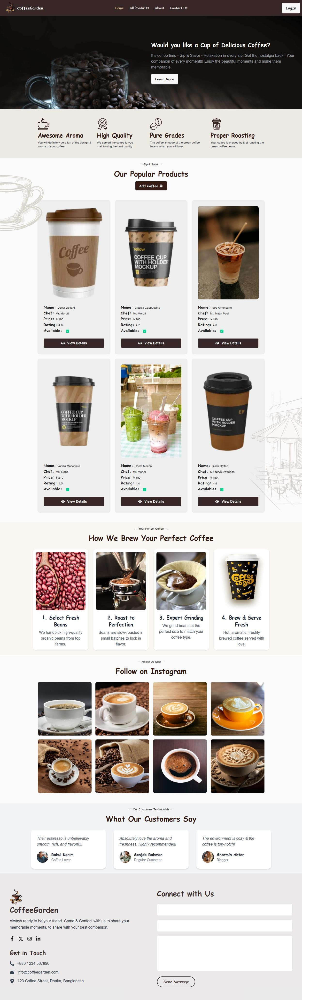

## Project Name: **☕ Coffee Garden**
## 🌱 Project Purpose:
Coffee Garden is a modern React-based web application where users can explore different types of coffee, learn more about their flavors, and add their favorite brews to their collection.
### Users can also:
- Share their feedback and coffee experiences
- Send coffee gifts to friends and loved ones
- Update and view their personal profiles

#### This project is a practical application to learn Firebase Authentication, React Router, and Dynamic Data Handling.

# 🔗 Live URL :-
- ### Vercel Hosting: [Click Coffee Garden](https://coffee-garden-delta.vercel.app/)

## ✨ Key Features
- ***User Authentication:*** Sign Up, Log In, and Password Reset with Firebase Authentication and Google
- ***Private Routes:*** Add New Coffee, Manage My Coffees, Details pages are protected and require login.
- ***Dynamic Coffee Listing:*** Fetches and displays coffee varieties with detailed pages
- ***Persistent Login:*** Retains user login state even after page reload (using onAuthStateChanged)
- ***Responsive Design:*** BOptimized for mobile, tablet, and desktop devices
- ***Error Handling:*** Custom error page for 404 or missing data
- ***Clean UI:*** Elegant interface styled with Tailwind CSS and DaisyUI


## Technologies & npm Packages Used
| Category       | Tools / Libraries          |
| -------------- | -------------------------- |
| Frontend       | Next.js (App Router)   |
| Styling        | Tailwind CSS, DaisyUI      |
| Authentication | Firebase                   |
| Icons          | React Icons                |
| Notifications  | React Toastify & Sweetalert2           |
| Deployment     | Vercel |
| Form Validation    | React Hook Form |
| Loader   | React spinners |
| Validation     | PropTypes   
| Data Handeling  |  MongoDB Database             |  
| Data Fetching  | React Axios & Normal fetch             | 

## Dependencies (Client Side)
```
"dependencies": {
    "axios": "^1.13.2",
    "firebase": "^12.6.0",
    "next": "16.0.3",
    "react": "19.2.0",
    "react-dom": "19.2.0",
    "react-hook-form": "^7.66.1",
    "react-icons": "^5.5.0",
    "react-spinners": "^0.17.0",
    "react-toastify": "^11.0.5",
    "sweetalert2": "^11.26.3"
  },
```
```
  "devDependencies": {
    "@tailwindcss/postcss": "^4",
    "babel-plugin-react-compiler": "1.0.0",
    "daisyui": "^5.5.5",
    "eslint": "^9",
    "eslint-config-next": "16.0.3",
    "tailwindcss": "^4"
  }
```
---
## 📸 Website Screenshots

### 🏠 Home Page


---
### 🖥️ How to Run Locally:
1. Clone the Repository

Create file CoffeeGarden
```
cd CoffeeGarden
```
```
https://github.com/ashadulislam6156rs/Coffee-Garden-With-Next.js.git

```
2. Install Dependencies
```
npm i
```
3. Start Development Server
```
npm run dev
# or
yarn dev
# or
pnpm dev
# or
bun dev
```

## ❤️ Thanks for Visiting Coffee Garden!
